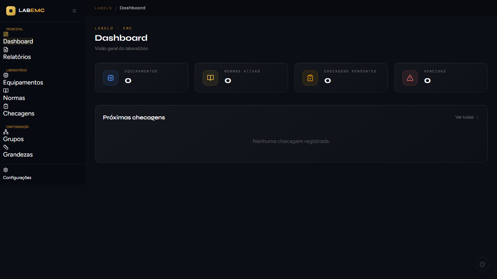
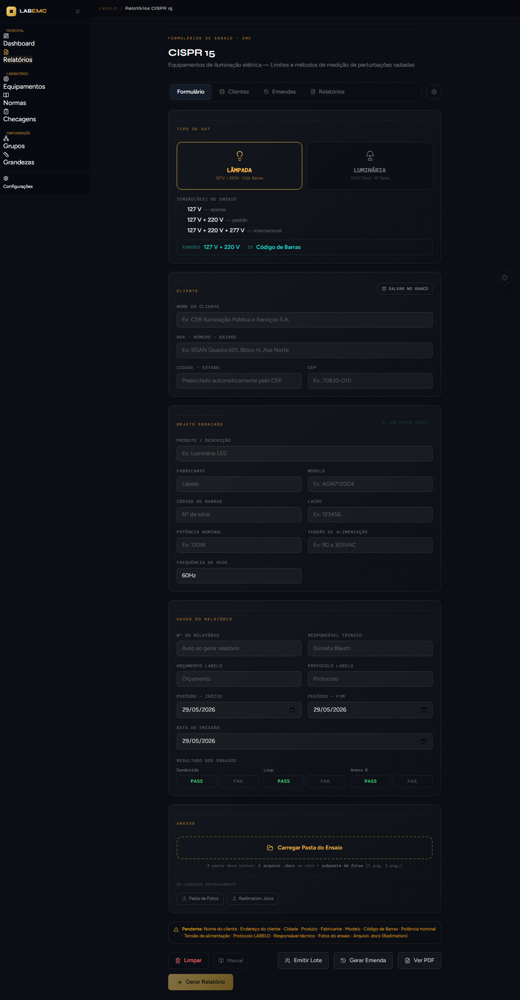
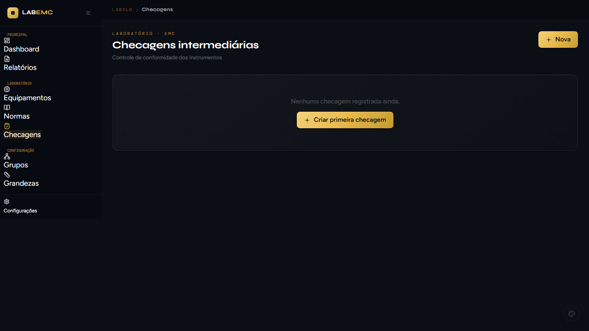
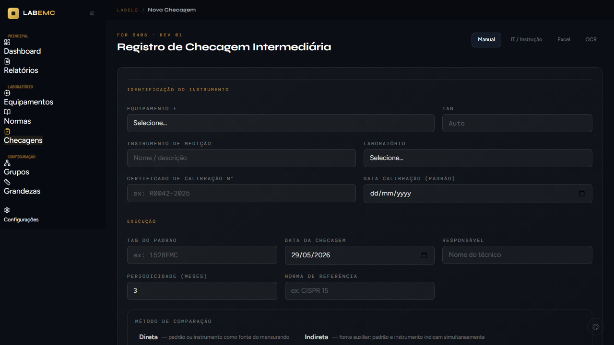
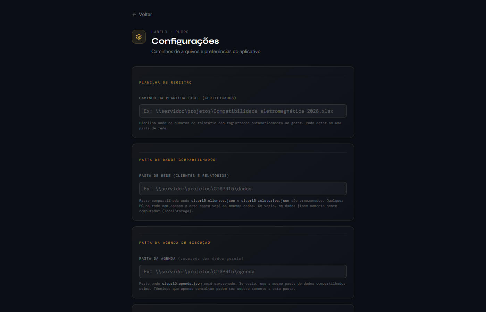

<div align="center">


# CISPR 15 LABELO

**Sistema de gestão de ensaios EMC e laboratório — LABELO / PUCRS**


</div>

---

## Visão geral

Aplicativo **desktop** (roda offline, sem servidor) para o **LABELO/PUCRS** que reúne, numa única interface, a emissão de relatórios de ensaio CISPR 15 e toda a gestão metrológica do laboratório.

| Módulo | Descrição |
|--------|-----------|
| **CISPR 15** | Formulário de ensaio (lâmpada/luminária), geração de PDF, registro em Excel, emendas, lote e banco de clientes |
| **Agenda** | Acompanhamento de protocolos/ensaios com status de prazo e emissão em lote |
| **Dashboard** | Visão geral de relatórios, emendas, checagens e equipamentos |
| **Equipamentos** | Inventário dos instrumentos por grupo/subgrupo |
| **Normas** | Biblioteca normativa (CISPR 15/11/32, IEC 61000-4-x, NBR 15947) com PDF |
| **Checagens** | Checagens intermediárias com periodicidade e rastreabilidade |
| **Certificados** | Certificados de calibração (pontos 1D e grade 2D freq × nível) |
| **Procedimentos** | Editor de IT/PC e checagem por certificado com interpolação |
| **Grandezas** | Grandezas metrológicas por equipamento |

---

## Telas

### Dashboard do laboratório



Visão geral: equipamentos cadastrados, normas ativas, checagens pendentes e vencidas, relatórios por mês.

---

### CISPR 15 — Formulário de ensaio


Seleção do tipo de DUT (Lâmpada ou Luminária), tensão(ões) de ensaio e dados do cliente. Os campos e limites se adaptam à norma. A **potência** assume `W` por padrão (basta digitar o número).

---

### CISPR 15 — Relatório com Word do Radimation



Upload do `.docx` exportado pelo Radimation. Converte os gráficos WMF/EMF para PNG, processa as tabelas de picos e gera o PDF final. Fotos e DOCX podem ser salvos na pasta da EUT pela aba Relatório.

---

### Checagens intermediárias



Controle de conformidade dos instrumentos, com periodicidade e status por vencimento. Checagens podem ser **editadas** e **excluídas**.



Ao informar a **TAG do padrão**, o sistema puxa o último certificado cadastrado e abre o painel para **marcar os pontos** (1D ou grade 2D) — cada ponto vira um ponto de checagem com grandeza, parâmetro, VR e correção, sem precisar de OCR.

---

### CISPR 15 — Relatórios salvos


Lista de relatórios com filtro por cliente/ano, status de aprovação, assinatura digital e botão para salvar os arquivos na pasta da EUT.

---

### Agenda de execução


Agenda de ensaios com status de prazo, registro de entrada/saída de EUTs e emissão em lote (com definição de período de início/fim para todas as amostras de uma vez).

---

### Configurações



Pastas de dados (suporte a unidades de rede/UNC), pasta de PDFs, planilha Excel, pasta de atualização e certificado de assinatura digital.

---

## Funcionalidades principais

- Geração de relatório CISPR 15 em PDF com **assinatura digital**
- Importação de resultados via **Word (Radimation)**, **Excel** ou **OCR**
- Conversão automática de gráficos **WMF/EMF → PNG**
- **Lote**: emissão de várias amostras; definição de período (início/fim) de todas de uma vez
- **Emendas** de relatório que reabrem completas em qualquer PC (assets por id na rede)
- Banco de clientes e histórico de relatórios
- **Checagens**: criar, **editar** e **excluir**; marcar pontos do certificado pela TAG (1D e grade 2D) com **interpolação** linear/bilinear
- Gestão de **equipamentos**, **certificados**, **normas** e **grandezas**
- **Procedimentos** IT/PC com editor próprio
- Dados em pasta de rede compartilhada (qualquer UNC)
- **Atualização automática** via GitHub Releases (zip, sem reinstalação)

---

## Estrutura do projeto

```
app/          rotas Next.js (cispr15, agenda, (lab)/*, api/*)
components/   componentes React compartilhados
lib/          domínio: checagens, certificados, normas, equipamentos, interpolação
electron/     processo principal, preload e auto-update
public/       assets estáticos servidos
assets/       ícones do app
bin/          wmf2png.exe (conversor WMF/EMF)
build/        installer.nsh (NSIS)
scripts/      publish-update.js (pós-build)
tools/        utilitários de dev (geração de manual, screenshots, wmf2png)
docs/         manuais (DOCX/PDF) e docs/screenshots/ (imagens)
```

---

## Instalação

### Primeira vez (PC sem instalador/admin)
1. Copie a pasta `win-unpacked` (ou a pasta portátil distribuída) para o PC local — ex.: `C:\CISPR15-LABELO\`
2. Abra `CISPR 15 LABELO.exe` (sem instalação, sem UAC). Os dados ficam em `%APPDATA%\cispr15-labelo` e sobrevivem a atualizações.

### Atualizações
No app: **Ajuda → Verificar atualizações**. Baixa o zip do GitHub, substitui os arquivos e reinicia — sem instalador.

---

## Desenvolvimento

```bash
npm install

# Modo dev (Next.js + Electron)
npm run dev          # terminal 1 — Next.js (porta 3000)
npm run electron     # terminal 2 — Electron

# Build (instalador + zip) e versão portátil
npm run dist                       # next build + electron-builder (nsis + zip)
npx electron-builder --win dir     # só a pasta win-unpacked (portátil)

# Build + publicar release no GitHub
npm run dist:publish
```

> Requer `GH_TOKEN` no `.env.local` com permissão de escrita em *Contents* do repositório.

---

## Stack

| Camada | Tecnologia |
|--------|-----------|
| Desktop | Electron 31 |
| Frontend | Next.js 14 + React 18 + Tailwind CSS |
| PDF | Puppeteer Core + assinatura digital (node-forge / @signpdf) |
| Office | Mammoth (DOCX → HTML) + xlsx / xlsx-populate |
| OCR | Windows OCR API |
| Atualização | GitHub Releases + updater customizado (zip) |

---

<div align="center">

Desenvolvido para **LABELO — Laboratório de Ensaios Elétricos** · PUCRS

</div>
