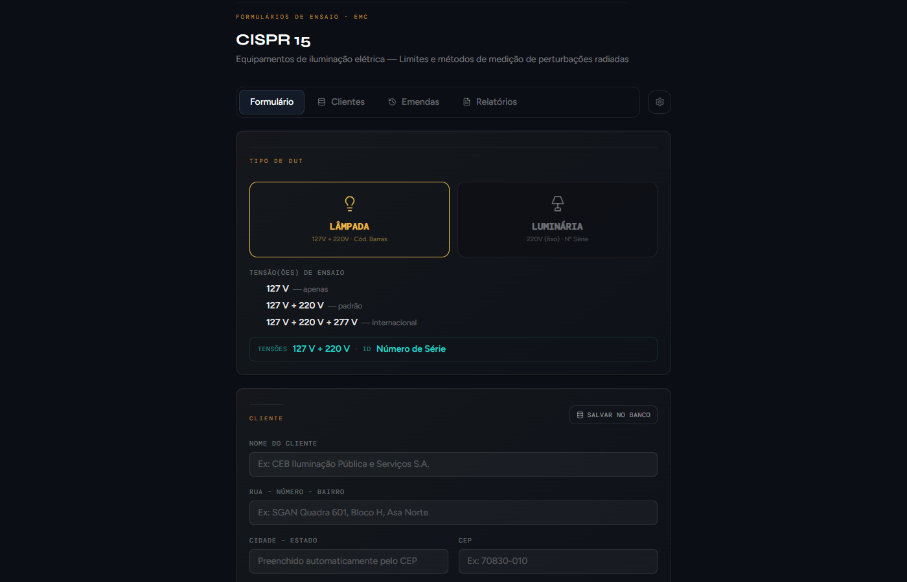
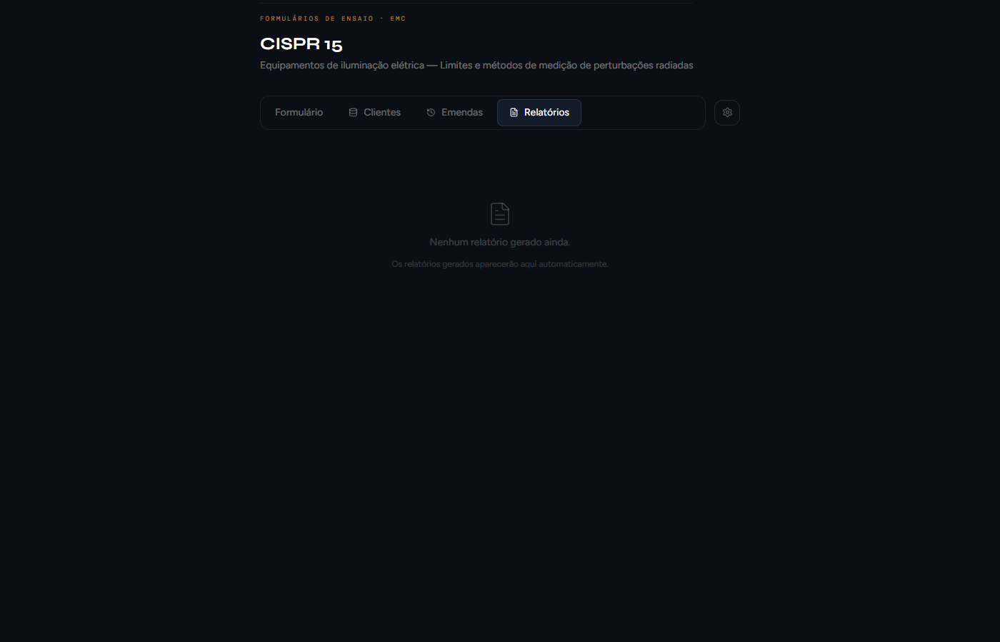
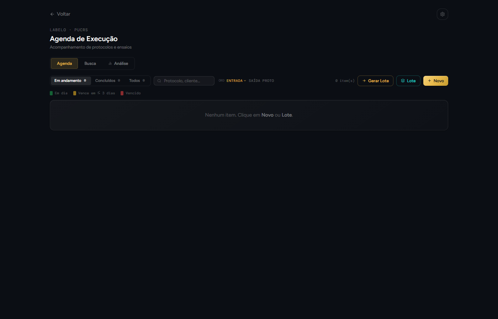

<div align="center">


# CISPR 15 LABELO

**Sistema de gestão de ensaios EMC e laboratório — LABELO / PUCRS**


</div>

---

## Visão geral

Aplicativo desktop para o **LABELO/PUCRS** que centraliza dois fluxos de trabalho:

| Módulo | Descrição |
|--------|-----------|
| **CISPR 15** | Geração de relatórios de ensaio de compatibilidade eletromagnética para equipamentos de iluminação (lâmpadas e luminárias), conforme NBR IEC/CISPR 15 |
| **Laboratório** | Gestão de equipamentos, certificados de calibração, checagens intermediárias, normas e grandezas |

---

## Telas

### Dashboard do laboratório


Visão geral do laboratório: equipamentos cadastrados, normas ativas, checagens pendentes e vencidas.

---

### CISPR 15 — Formulário de ensaio



Seleção do tipo de DUT (Lâmpada ou Luminária), tensão(ões) de ensaio e dados do cliente. O sistema adapta automaticamente os campos e limites conforme a norma.

---

### CISPR 15 — Relatório com Word do Radimation


Upload do arquivo `.docx` exportado pelo Radimation. O sistema converte automaticamente os gráficos WMF/EMF para PNG, processa as tabelas de picos e gera o relatório final em PDF.

---

### Checagens intermediárias


Registro de checagens de conformidade dos instrumentos de medição, com controle de periodicidade e rastreabilidade metrológica.


Formulário completo de checagem: identificação do instrumento, certificado de calibração, método de comparação (Direta / Indireta) e resultado.

---

### CISPR 15 — Relatórios salvos



Lista de relatórios salvos com filtro por cliente, status de aprovação e acesso rápido ao PDF.

---

### Agenda de execução



Agenda de ensaios com visualização por mês, registro de entrada e saída de EUTs e controle de prazo.

---

### Configurações


Definição das pastas de dados (suporte a unidades de rede), pasta de PDFs, planilha Excel e certificado de assinatura digital.

---

## Funcionalidades principais

- Geração de relatório CISPR 15 em PDF com assinatura digital
- Importação de resultados via Word (Radimation), Excel ou OCR de imagem
- Conversão automática de gráficos WMF/EMF para PNG
- Banco de clientes e histórico de relatórios
- Gestão de equipamentos com certificados de calibração vinculados
- Checagens intermediárias com alerta de vencimento
- Biblioteca de normas e grandezas metrológicas
- Dados em pasta de rede compartilhada (T:\ ou qualquer UNC)
- **Atualização automática** via GitHub Releases (sem reinstalação)

---

## Instalação

### Primeira vez
1. Copie a pasta `win-unpacked` para o PC local (ex: `C:\CISPR15-LABELO\`)
2. Abra `CISPR 15 LABELO.exe`

### Atualizações
No app: **Ajuda → Verificar atualizações**

O sistema baixa o zip do GitHub, substitui os arquivos e reinicia automaticamente — sem instalador, sem UAC.

---

## Desenvolvimento

```bash
# Instalar dependências
npm install

# Modo dev (Next.js + Electron)
npm run dev          # terminal 1 — Next.js
npm run electron     # terminal 2 — Electron

# Build + publicar release no GitHub
npm run dist:publish
```

> Requer `GH_TOKEN` no arquivo `.env.local` com permissão de escrita em Contents do repositório.

---

## Stack

| Camada | Tecnologia |
|--------|-----------|
| Desktop | Electron 31 |
| Frontend | Next.js 14 + React 18 + Tailwind CSS |
| PDF | Puppeteer Core + assinatura digital (node-forge) |
| Office | Mammoth (DOCX → HTML) + xlsx / xlsx-populate |
| OCR | Windows OCR API (PowerShell) |
| Atualização | GitHub Releases + updater customizado (zip) |

---

<div align="center">

Desenvolvido para **LABELO — Laboratório de Ensaios Elétricos** · PUCRS

</div>
